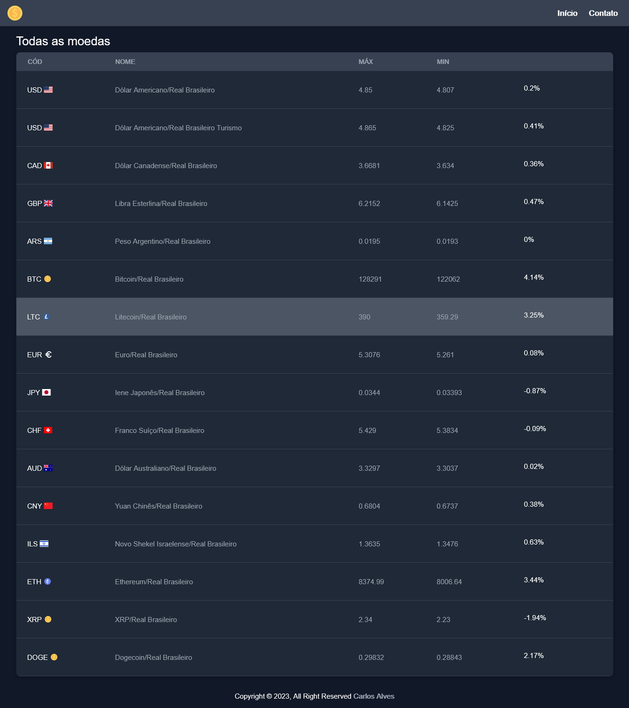

# Real-time Currency Exchange Rates for Brazilian Real | Current Quotes

This project provides the latest real-time currency exchange rates for Brazilian Real (BRL) on our website. Our goal is to provide accurate, up-to-date data for various currencies around the world.

## Features
- Real-time currency exchange rates for Brazilian Real
- Accurate and up-to-date data
- User-friendly interface

## Technologies Used
- React
- Next.js
- Tailwindcss
- API integration

## How to use
Run the development server:

```bash
npm run dev
# or
yarn dev
# or
pnpm dev
```

## Requirements
- Modern web browser with JavaScript enabled

## Demo


## Contributing
We welcome contributions from anyone who would like to help improve our service. If you would like to contribute, please feel free to contact us or submit a pull request.